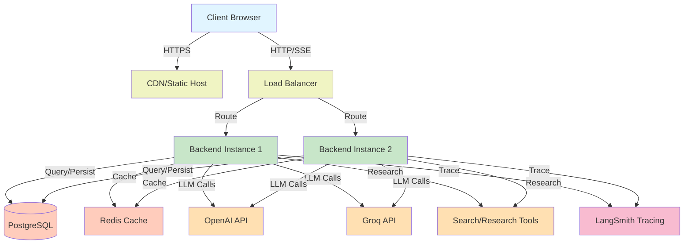
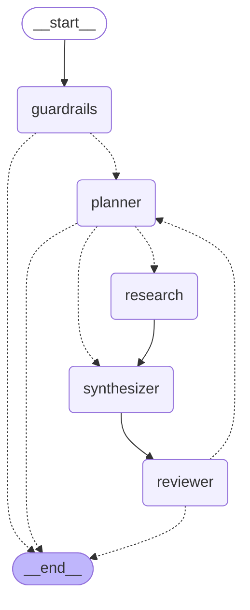
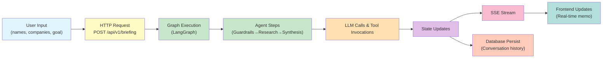

# Architecture

## System Overview

Quorum is a distributed, asynchronous system for generating pre-meeting intelligence. It separates concerns into three tiers:

- **Frontend** (Vue 3 + TypeScript): Single-page web app. Users submit meeting context, watch real-time briefing generation via SSE, and refine results via chat.
- **Backend** (FastAPI + Python): REST API and async agent orchestration engine. Handles auth, request routing, state management, LLM orchestration, tool invocation, and persistence.
- **Data Layer** (PostgreSQL + optional Redis): Stores users, conversations, briefing history, and optionally caches frequently accessed data.

### System Architecture Diagram



## Agent Orchestration Pipeline

The core briefing generation engine is a stateful workflow orchestrated by [LangGraph](https://python.langchain.com/docs/langgraph/). When a user submits pre-meeting context, it flows through specialized agents:



### Agent Responsibilities

| Agent | Purpose | Timeout | Output |
|-------|---------|---------|--------|
| **Guardrails** | Validate input specificity, detect spam/noise, early filtering | 10s | `GuardrailsOutput` with pass/fail flag |
| **Planner** | Analyze context, create research questions, plan approach | 15s | `ResearchPlan` with key questions and scope |
| **Research** | Execute plan using web search, company APIs, tool invocation | 30s | `ResearchFindings` with sources and data |
| **Synthesizer** | Write concise pre-meeting memo from findings | 15s | `BriefingMemo` with sections and summary |
| **Reviewer** | Fact-check, validate synthesis, flag uncertainties | 10s | `ReviewFeedback` with confidence scores and corrections |

**Key design choices:**

- **Early exit**: Guardrails can reject input before expensive research begins.
- **Fallback routing**: If Planner fails, optionally skip to Synthesizer with generic plan.
- **Loop allowed**: Reviewer can route back to Planner for refinement (future).
- **Streaming**: Each agent step is emitted to the frontend via SSE as it completes.

### Data Flow During Briefing Generation




## Backend Architecture

### Folder Structure and Purposes

```
backend/
├── app/
│   ├── agents/                 # Agent implementations (guardrails, planner, etc.)
│   │   ├── __init__.py
│   │   ├── guardrails.py       # Input validation and filtering agent
│   │   ├── planner.py          # Research planning agent
│   │   ├── research.py         # Research execution agent
│   │   ├── synthesizer.py      # Memo writing agent
│   │   └── reviewer.py         # Final review and quality check agent
│   │
│   ├── api/                    # HTTP layer
│   │   ├── __init__.py
│   │   ├── auth_limits.py      # Rate limiting configuration
│   │   ├── deps.py             # Dependency injection (DB session, auth, etc.)
│   │   └── endpoints/          # API route modules
│   │       ├── auth.py         # /auth/* routes (register, login, refresh)
│   │       ├── briefing.py     # /briefing/* routes (create, get history)
│   │       ├── chat.py         # /chat/* routes (streaming SSE, post message)
│   │       └── user.py         # /user/* routes (profile, preferences)
│   │
│   ├── core/                   # Core application infrastructure
│   │   ├── __init__.py
│   │   ├── bootstrap.py        # App startup, initialization, LangSmith config
│   │   ├── database.py         # SQLAlchemy async session factory
│   │   ├── security.py         # JWT token generation/validation, password hashing
│   │   ├── agent_factory.py    # LLM provider abstraction, agent initialization
│   │   ├── logging_config.py   # Structured logging setup
│   │   ├── metrics.py          # Prometheus metrics and instrumentation
│   │   ├── tracing.py          # OpenTelemetry/LangSmith integration
│   │   └── exceptions.py       # Custom exception classes
│   │
│   ├── graph/                  # LangGraph workflow orchestration
│   │   ├── __init__.py
│   │   ├── briefing_graph.py   # Main graph definition and compilation
│   │   ├── briefing_nodes.py   # Node implementations for each agent
│   │   └── feedback_markers.py # Markers for conditional routing
│   │
│   ├── models/                 # SQLAlchemy ORM models
│   │   ├── __init__.py
│   │   ├── base.py             # Base model with timestamps, IDs
│   │   ├── user.py             # User account model
│   │   ├── conversation.py     # Briefing request model
│   │   ├── message.py          # Chat message model
│   │   └── refresh_token.py    # Token revocation model
│   │
│   ├── schema/                 # Pydantic validation models
│   │   ├── __init__.py
│   │   ├── auth.py             # RegisterRequest, LoginRequest, TokenResponse
│   │   ├── user.py             # UserCreate, UserResponse
│   │   ├── briefing.py         # BriefingRequest, BriefingResponse
│   │   ├── conversation.py     # ConversationCreate, MessageResponse
│   │   ├── agents.py           # Agent I/O schemas (GuardrailsOutput, etc.)
│   │   └── search.py           # Search tool response schemas
│   │
│   ├── services/               # Business logic layer
│   │   ├── __init__.py
│   │   ├── auth_service.py     # User auth, token lifecycle, password reset
│   │   ├── chat_service.py     # Chat/briefing request orchestration
│   │   ├── history_service.py  # Conversation history retrieval
│   │   ├── email_service.py    # Email sending (Mailtrap integration)
│   │   ├── email_render.py     # Email template rendering
│   │   └── exceptions.py       # Service-layer exceptions
│   │
│   ├── tools/                  # External tool integrations
│   │   ├── __init__.py
│   │   └── search_tools.py     # Web search, Tavily integration
│   │
│   ├── guardrails/             # Input validation guardrails
│   │   ├── __init__.py
│   │   ├── input_size.py       # Token/length limits
│   │   └── prompt_guard.py     # Prompt injection detection
│   │
│   ├── cache/                  # Caching strategies
│   │   ├── __init__.py
│   │   ├── base.py             # Cache interface
│   │   ├── factory.py          # Cache provider factory
│   │   ├── memory.py           # In-memory cache (dev)
│   │   ├── redis_backend.py    # Redis cache (production)
│   │   └── upstash.py          # Upstash Redis (serverless)
│   │
│   ├── config/                 # Configuration management
│   │   ├── __init__.py
│   │   ├── app_settings.py     # Main AppSettings (Pydantic BaseSettings)
│   │   ├── agents.py           # Agent config (model, provider, prompts)
│   │   ├── cache.py            # Cache configuration
│   │   ├── rate_limits.py      # Rate limit thresholds
│   │   └── guardrails.py       # Guardrail settings
│   │
│   ├── templates/              # Email templates
│   │   └── email/
│   │       ├── verify_email.html
│   │       ├── password_reset.html
│   │       └── briefing_ready.html
│   │
│   └── main.py                 # FastAPI app factory, middleware setup
│
├── migrations/                 # Alembic database migrations
│   ├── env.py                  # Migration environment
│   ├── script.py.mako          # Migration template
│   └── versions/               # Individual migration files
│
├── scripts/                    # Utility scripts
│   ├── __init__.py
│   ├── migrate_db.py           # Database migration runner
│   ├── drop_all_tables.py      # Development only: schema reset
│   ├── briefing_graph_export.py # Export graph diagram (for debugging)
│   └── load_fixtures.py        # Test data loading
│
├── tests/                      # Test suite
│   ├── __init__.py
│   ├── conftest.py             # Pytest fixtures (DB, auth, etc.)
│   ├── test_agents.py          # Agent unit tests
│   ├── test_api_endpoints.py   # API integration tests
│   ├── test_auth.py            # Authentication tests
│   └── test_services.py        # Service layer tests
│
├── pyproject.toml              # Dependencies, metadata
├── main.py                     # Application entry point
├── .env.example                # Environment template
├── alembic.ini                 # Alembic configuration
└── requirements.txt            # Pip dependencies (frozen)
```

### Key Backend Principles

**Async First**: All I/O is async—database queries, API calls, LLM invocations, file operations. This enables a single process to handle hundreds of concurrent users without threading complexity.

**Dependency Injection**: FastAPI's `Depends()` injects database sessions, auth context, and services into route handlers. This keeps code modular and testable.

**Structured Validation**: Pydantic models validate all input before reaching business logic. Request and response schemas are the contract between frontend and backend.

**Service Layer**: Business logic lives in `services/`, not endpoints. Each service handles a domain (auth, chat, history). This keeps endpoints thin and logic reusable.

**Factory Pattern for LLMs**: `AgentFactory` abstracts LLM provider details. Swap between OpenAI, Groq, Google by changing env vars—no code changes.

## Frontend Architecture

### Folder Structure and Purposes

```
frontend/
├── src/
│   ├── api/                    # Backend API client
│   │   ├── auth.ts             # Auth endpoints (register, login, refresh)
│   │   ├── briefing.ts         # Briefing creation and history
│   │   ├── chat.ts             # Chat and SSE streaming
│   │   └── index.ts            # HTTP client factory with interceptors
│   │
│   ├── components/             # Reusable UI components
│   │   ├── auth/
│   │   │   ├── LoginForm.vue
│   │   │   └── RegisterForm.vue
│   │   ├── briefing/
│   │   │   ├── BriefingCard.vue # Briefing display card
│   │   │   ├── BriefingFeed.vue # List of briefings
│   │   │   └── StreamingMemo.vue # Real-time memo view
│   │   ├── chat/
│   │   │   ├── ChatInput.vue    # Message input
│   │   │   ├── ChatMessages.vue # Message list with streaming support
│   │   │   └── AgentProgress.vue # Agent step indicators
│   │   ├── layout/
│   │   │   ├── Header.vue       # Top navigation
│   │   │   ├── Sidebar.vue      # Left sidebar
│   │   │   └── Footer.vue       # Footer
│   │   └── common/
│   │       ├── Button.vue
│   │       ├── Modal.vue
│   │       └── LoadingSpinner.vue
│   │
│   ├── views/                  # Full-page components
│   │   ├── auth/
│   │   │   ├── LoginView.vue
│   │   │   ├── RegisterView.vue
│   │   │   └── ResetPasswordView.vue
│   │   ├── ChatView.vue        # Main briefing chat interface
│   │   ├── DashboardView.vue   # Briefing history dashboard
│   │   ├── LandingView.vue     # Public landing page
│   │   └── ObservabilityView.vue # Admin observability dashboard
│   │
│   ├── stores/                 # Pinia state management
│   │   ├── index.ts            # Store creation factory
│   │   ├── auth.ts             # User auth, JWT token, login state
│   │   ├── briefing.ts         # Current briefing, request status
│   │   ├── chat.ts             # Chat messages, SSE connection
│   │   ├── history.ts          # Briefing history/conversations
│   │   └── ui.ts               # UI state (modals, toasts, theme)
│   │
│   ├── router/                 # Vue Router configuration
│   │   └── index.ts            # Route definitions, guards
│   │
│   ├── lib/                    # Utility functions
│   │   ├── api-client.ts       # Axios instance with auth interceptors
│   │   ├── sse-handler.ts      # SSE subscription logic
│   │   ├── date-utils.ts       # Date formatting
│   │   ├── markdown-renderer.ts # Markdown to HTML with sanitization
│   │   └── error-handler.ts    # Global error handling
│   │
│   ├── assets/                 # Static resources
│   │   ├── styles/
│   │   │   ├── main.css        # Global styles, Tailwind config
│   │   │   ├── variables.css   # Design tokens (colors, spacing)
│   │   │   └── animations.css  # Custom animations
│   │   ├── icons/
│   │   └── images/
│   │
│   ├── App.vue                 # Root component
│   ├── main.ts                 # App entry point
│   └── vite-env.d.ts           # TypeScript Vite types
│
├── public/                     # Static files (favicons, etc.)
├── index.html                  # HTML entry point
├── vite.config.ts              # Vite build config with API proxy
├── tsconfig.json               # TypeScript config
├── postcss.config.js           # PostCSS (Tailwind) config
├── .env.example                # Environment template
└── package.json                # Dependencies, scripts
```

### Key Frontend Principles

**Real-Time Streaming**: Uses Server-Sent Events (SSE) for unidirectional server-to-client updates. As agents complete steps, `StreamingMemo.vue` updates in place instead of polling.

**Reactive State**: Pinia stores are reactive. Components subscribe to store state and automatically re-render when it changes. Auth state, briefing status, chat messages—all flow through stores.

**API Abstraction**: All backend calls live in `src/api/`. Components never import HTTP clients directly—they call service functions. This decouples UI from API details.

**Typed API Calls**: TypeScript ensures frontend and backend schemas stay in sync. Type definitions are generated or manually kept up-to-date.


## API Contracts

### Authentication

```
POST   /api/v1/auth/register          # { email, password } → { access_token, refresh_token }
POST   /api/v1/auth/login             # { email, password } → { access_token, refresh_token }
POST   /api/v1/auth/refresh           # { refresh_token } → { access_token }
POST   /api/v1/auth/logout            # (revokes tokens)
POST   /api/v1/auth/forgot-password   # { email } → sends reset link
POST   /api/v1/auth/reset-password    # { token, new_password }
```

### Briefings

```
POST   /api/v1/briefing                # { names, companies, goal } → { conversation_id, status }
GET    /api/v1/briefing/{id}           # Retrieve briefing details
GET    /api/v1/briefing                # List user's briefings with pagination
GET    /api/v1/briefing/{id}/stream    # SSE stream of generation progress
```

### Chat

```
POST   /api/v1/chat/{conversation_id}  # { message } → streams responses
GET    /api/v1/chat/{conversation_id}  # Get conversation history
```

All endpoints return structured responses:

```json
{
  "success": true,
  "data": { ... },
  "error": null,
  "timestamp": "2026-05-11T10:00:00Z"
}
```

Errors follow a standard shape:

```json
{
  "success": false,
  "error": {
    "code": "INVALID_INPUT",
    "message": "Meeting goal is required",
    "details": { "field": "goal" }
  }
}
```

## Error Handling and Retry Strategy

### Agent Failures

| Scenario | Behavior | Retry? |
|----------|----------|--------|
| **Guardrails rejects input** | Return error to user immediately | No—input is invalid |
| **Planner fails** | Skip to Synthesizer with generic plan | Yes—3 retries with backoff |
| **Research fails** | Continue with partial data, flag as uncertain | Yes—tool-specific retry |
| **Synthesizer fails** | Return research findings as-is, no memo | Yes—2 retries |
| **Reviewer fails** | Return memo without review flag | Yes—1 retry |

### LLM Call Failures

- **Timeout** (>60s): Fail immediately, don't retry (token budget wasted)
- **Rate limit** (429): Exponential backoff (2s, 4s, 8s) up to 3 retries
- **API error** (5xx): Same backoff, 2 retries
- **Invalid response** (unparseable JSON): Retry once with adjusted prompt

### Database Failures

- **Connection error**: Exponential backoff, 5 retries over 30 seconds
- **Transaction conflict**: Immediate retry (SQLAlchemy handles this)
- **Timeout**: Fail and alert ops

## Security

### Authentication
- JWT tokens with 30-minute expiry for access, 7-day expiry for refresh
- Refresh tokens stored in secure HTTP-only cookies (production)
- Password hashing with `argon2-cffi`
- Email verification required before user activation

### Authorization
- Row-level security: Users can only access their own conversations
- API endpoints check user context before returning data
- Admin endpoints require explicit role claim in JWT

### Input Validation
- All request bodies validated with Pydantic schemas
- Guardrail agents perform additional content validation
- Query parameter limits (pagination max 100 items)
- Request body size limits (32 KB for briefing input)

### Data Protection
- All API calls over HTTPS in production
- Database passwords stored in environment, never in code
- LLM API keys never logged or exposed in error messages
- User PII (email, names) sanitized before any external API calls

### Rate Limiting
- 30 requests/minute per IP (unauthenticated)
- 20 requests/minute per user (authenticated)
- 20 briefing requests/hour per user (expensive operations)

## Scalability & Performance

### Horizontal Scaling
- Backend is stateless; multiple instances can share the same PostgreSQL
- Redis used for distributed rate limiting and optional response caching
- Frontend is static; serve from CDN for global distribution

### Performance Optimizations
- Database connection pooling (asyncpg)
- Query result caching for frequently accessed data (brief lifespan, 5-10 min)
- Lazy loading of agent outputs (only parse what's needed)
- SSE streaming avoids waiting for entire briefing before first update
- Frontend lazy-loads components, code-split by route

### Limits
- Maximum briefing size: 5000 tokens of input
- Agent timeout: 60 seconds per agent (300s total pipeline)
- Chat session: max 100 messages per conversation
- Concurrent briefings per user: 5 per hour

## Observability & Debugging

### Logging
- Structured JSON logs with context (user_id, conversation_id, request_id)
- Log levels: DEBUG, INFO, WARNING, ERROR
- LangChain logs at INFO; agent I/O logged with input/output truncated to 500 chars

### Tracing
- LangSmith integration (optional, off by default)
- Each agent step traced with inputs, outputs, latency, token usage
- Span tags include user, model, agent name
- Critical for debugging agent behavior and LLM provider issues

### Metrics
- Prometheus metrics: request latency, agent duration, LLM tokens, errors
- Dashboard alerts for: high error rate, slow agent steps, DB connection pool exhaustion

## Deployment Options

### Development
- Backend: `uvicorn app.main:app --reload` (single process, SQLite OK)
- Frontend: `npm run dev` (Vite dev server with proxy)
- All in one local environment


